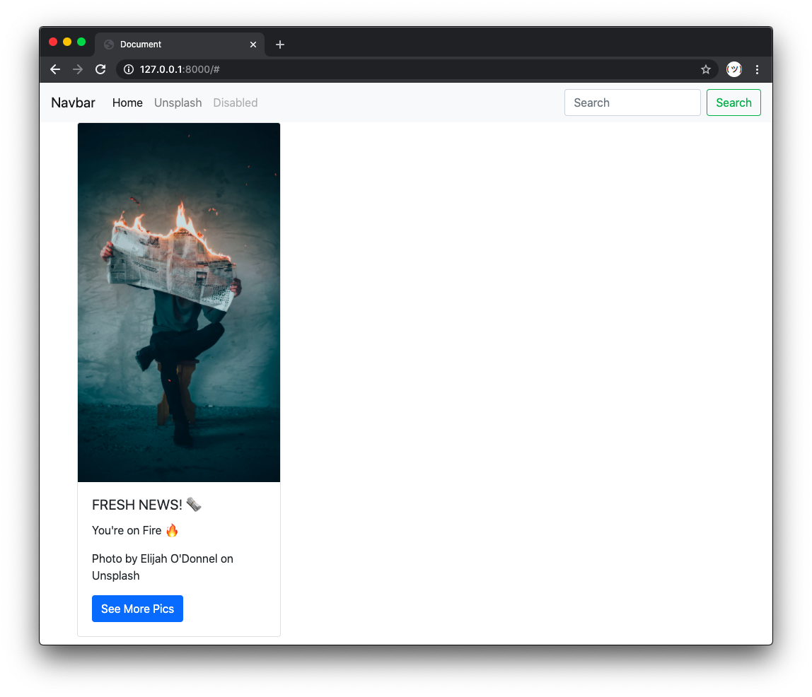

# Fix Missing Style

Your boss told you that they found this project online and it should look nice and modern, however, currently it looks... messy! They say that they expect it to look like below, and that you have exactly 1 hour to prove your worth:

You decide that working in a toxic environment like that isn't worth it and that you can do much better and put in your one-day-notice. However, because you're a nice person, you still go ahead and apply the necessary **style fix**.

Your task is complete when the page displays styled like in the example picture above.
